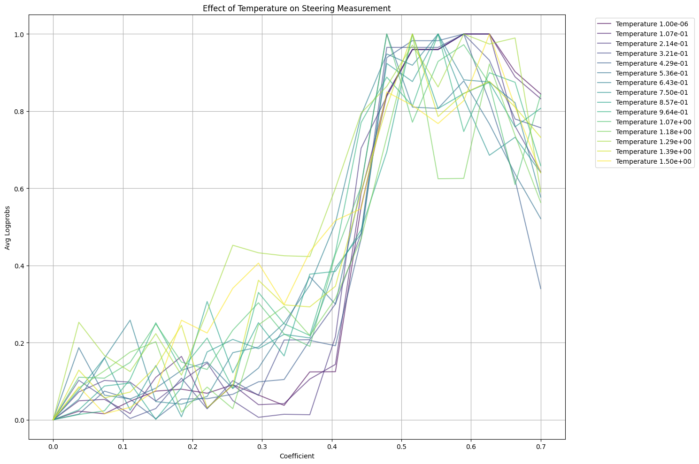
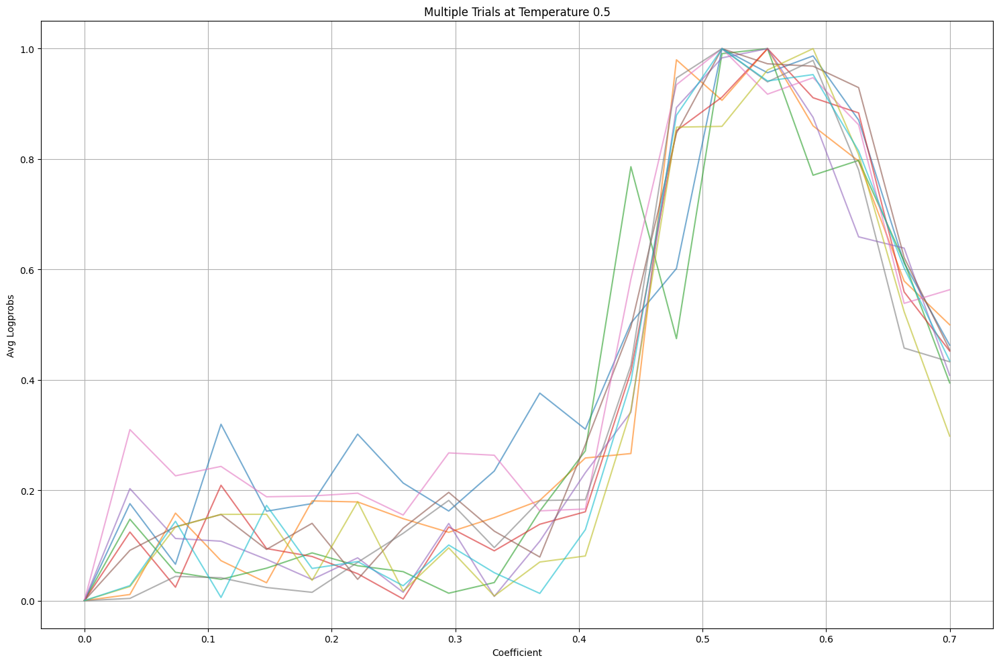
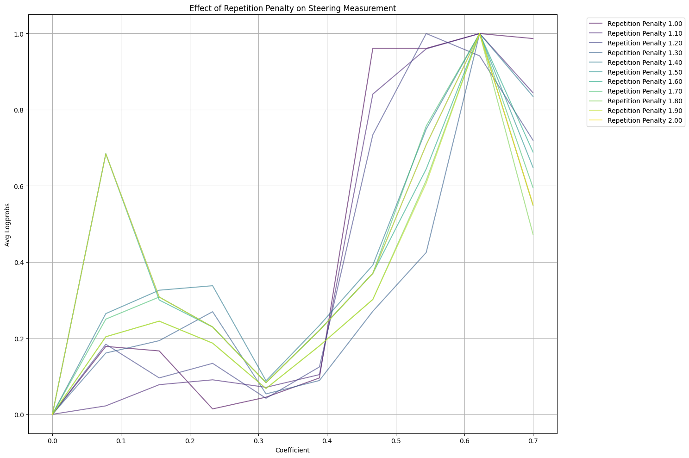
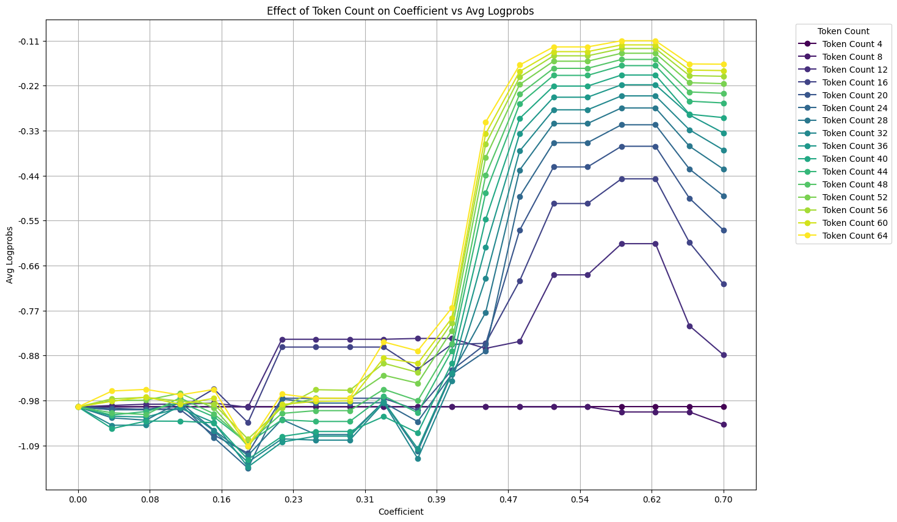
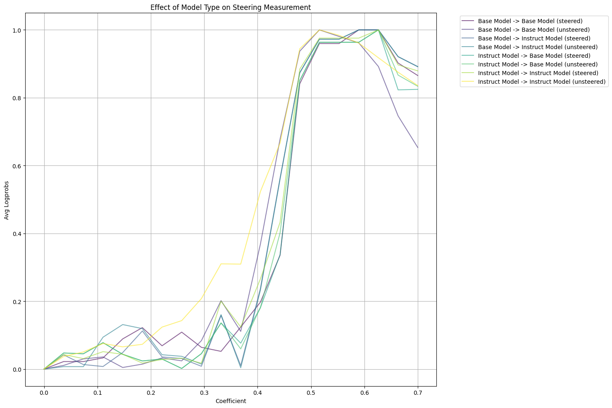
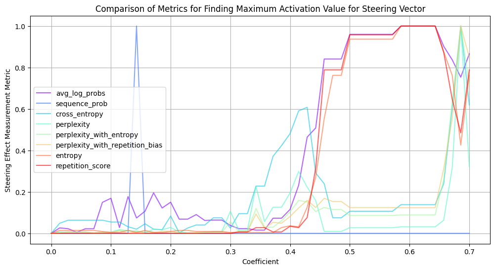
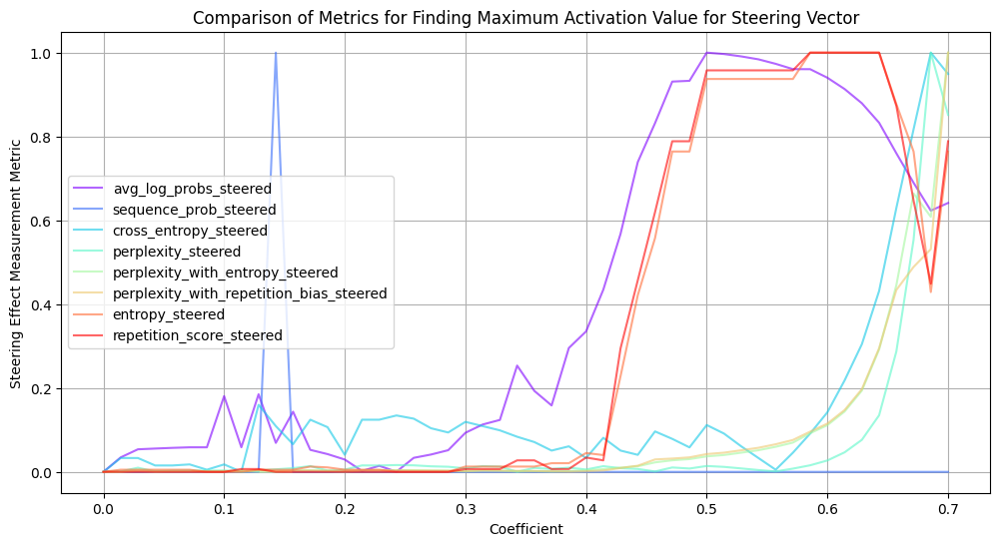
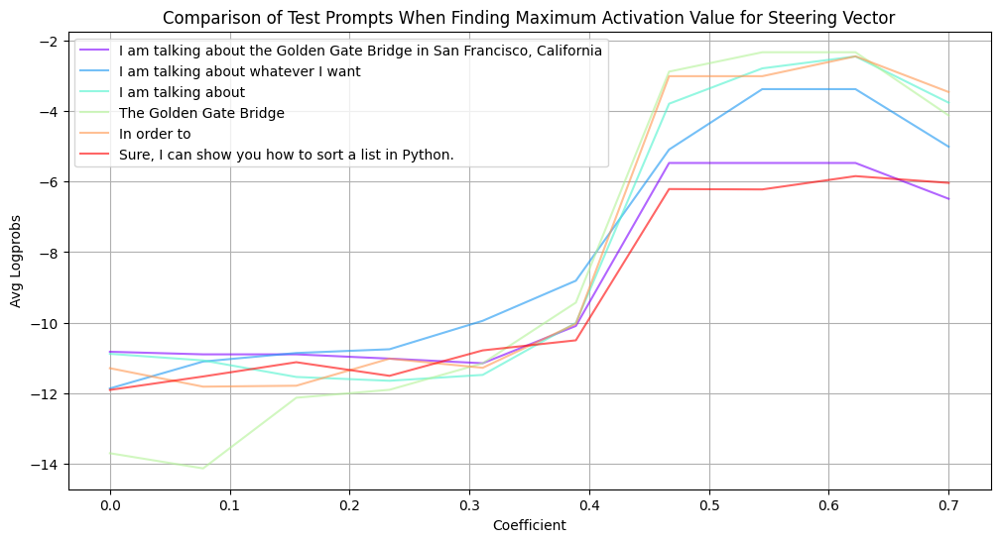
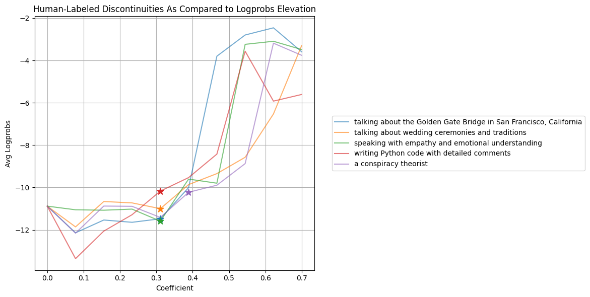
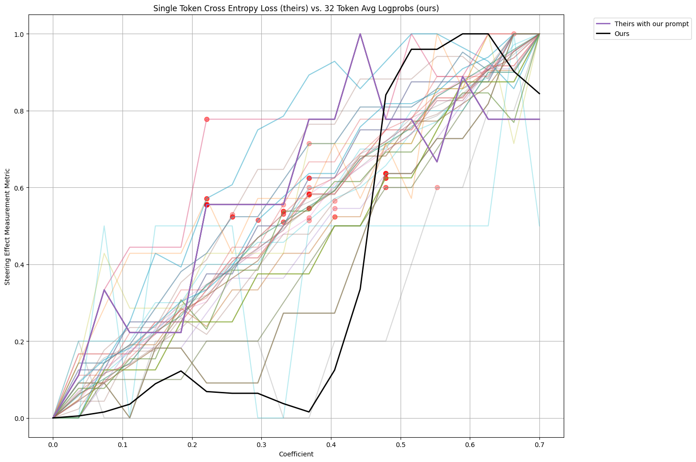

# Choosing Optimal Coefficients for Model Steering

## Introduction

Language models can be controlled by directly manipulating their internal representations - a technique known as representation engineering or "rep eng." The key insight is that by modifying the activations within specific layers of the model, we can guide its behavior in predictable ways without fine-tuning or additional training.

A common approach to rep eng involves creating "steering vectors" from the difference between desired and undesired behaviors. By prompting the model with positive examples (desired behavior) and negative examples (undesired behavior), we can capture the activation patterns that distinguish them. Applying Principal Component Analysis (PCA) to these activation differences yields steering vectors that can be added back to the model's activations during generation to guide its outputs.

However, a crucial practical challenge emerges: how do you choose the right coefficient for applying these steering vectors? Too small, and the vector has no effect. Too large, and your model becomes incoherent. While you could iteratively test coefficients and manually evaluate outputs, this approach is time-consuming and imprecise. This post presents a systematic investigation into metrics and methods for automatically determining optimal steering coefficients.

## Technical Setup

Our investigation uses EleutherAI's Sparse Autoencoders - one SAE per layer - trained on LLaMA 3 8B base. Each SAE operates on the residual stream of its respective layer with a 32x expansion factor, meaning its internal dimension is 32 times that of the model's residual stream. We tested our methods on both the base and instruction-tuned versions of LLaMA 3.

Our key insight was that there should be clear statistical indicators when a model transitions from effectively steered to incoherent - we just needed to find the right metric and control for various confounding factors that could obscure this signal. Our method works by analyzing model behavior across a range of coefficient values. For each coefficient, we generate text using the steered model and compute a metric on the output.

## Core Method and Results

### Finding the Right Metric

Average log probabilities emerged as the most reliable indicator of steering effectiveness and model coherence. For each token the model generates, its log probability represents how "natural" or "likely" the model considers that choice - the higher the probability, the more confident the model is in that token. By averaging these log probabilities across all tokens in a generation, we get a measure of how natural the model finds its entire output.

The intuition is compelling: when steering is working well, the model remains confident in its choices while being guided toward desired content. However, when steering becomes too strong, the model is forced to make increasingly unlikely token choices to maintain the steering direction, causing a characteristic spike in average log probabilities. While we evaluated numerous metrics (see Appendix B for full analysis), average log probs uniquely captures both:
1. Elevation during successful steering (before incoherence)
2. Sharp spike at the point of incoherence

This allows us to define a practical threshold: the maximum useful coefficient is the first point where the metric increases more than 20% above baseline. This 20% threshold is somewhat arbitrary - the metric typically spikes dramatically enough that the exact percentage isn't crucial. We chose 20% because we occasionally see earlier, smaller spikes above baseline, and this threshold safely clears them. Higher thresholds (e.g., 30% or 40%) work equally well, though they might require slightly more coefficient backoff to find the optimal operating point, as you'll be detecting the incoherence transition slightly later.

### Optimal Generation Parameters

Through extensive testing, we identified the following configuration optimal for detecting the coherence threshold:
- Temperature: 0 (greedy decoding)
- Repetition penalty: 1.1
- Token count: 32
- Evaluation: Unsteered model
- Evaluation prompt: Shared prefix between positive and negative prompts

(See Appendix A for detailed parameter analysis and justification)
It's important to note that these parameters are specifically optimized for clearly measuring the transition to incoherence - when actually using steering vectors in practice, you might want different settings (particularly for temperature & token count) depending on your application. Additionally, these optimal values are specific to our technical setup with LLaMA 3 and EleutherAI's SAE implementation; other models or steering approaches might benefit from different parameters.

For detailed examples of how model outputs and log probabilities progress from baseline through effective steering to incoherence, see Section X [forthcoming], which provides comprehensive examples across different steering types and use cases.

### Evaluation Approach

When evaluating steering vectors, we use the original unsteered model to compute metrics on text generated by the steered model. This provides clearer signals than using the steered model for evaluation, as the original model better detects deviations from natural language patterns. It's like having an independent observer who hasn't been influenced by the steering process.

## Real-World Application

Our method works reliably across different types of steering vectors:

### Descriptive/Conceptual Steering
- Topic constraints (e.g., "discussing quantum physics")
- Domain expertise
- Perspective taking

Section Y [forthcoming] provides concrete examples for each category, demonstrating how our method consistently identifies useful coefficient ranges before incoherence sets in. The absolute values vary between steering types (as expected), but the pattern of elevation followed by a sharp drop at incoherence remains consistent.

### Style/Voice Steering
- Technical vs casual writing
- Emotional tone (e.g., empathy)
- Character voice impersonation

### Task/Format Steering
- Programming language constraints
- Documentation format
- Structured data generation

In practice, we've found the method is robust across these categories, consistently identifying useful coefficient ranges before incoherence sets in. The absolute values vary between steering types (as expected), but the pattern of elevation followed by a sharp increase at incoherence remains consistent. See Appendix C for detailed comparison.

## Comparison with Existing Methods

Recent work ([Chalnev, Siu, Conmy](https://arxiv.org/abs/2411.02193)) has proposed using a cross-entropy loss threshold on a single token to determine maximum coefficient values. While computationally efficient, this approach sacrifices precision for speed. Our multi-token approach and extensively tested evaluation parameters provide a much clearer and more consistent signal. See Appendix D for detailed comparison.

## Limitations and Future Work

This work assumes steering vectors trained with a fixed set of layers or SAE features. The coefficient ranges can vary based on:
- Number of layers or features used
- Which layers or features are chosen

Future work could explore automatic coefficient selection across these variables and investigate methods for reducing the computational overhead of multi-token evaluation.

## Conclusion

Finding optimal steering coefficients doesn't have to be a manual process. With careful attention to generation parameters and the right metric, we can automatically detect when a steering vector transitions from effective to incoherent. This enables more systematic and scalable approaches to model steering.

## Appendix A: Detailed Parameter Analysis

### Temperature Effects

Generation parameters significantly impact metric reliability. Our investigation of temperature revealed two key problems with higher temperature values:

1. Less Sharp Transitions: Higher temperatures make the metric curve smoother, making it harder to detect the precise point where steering becomes incoherent. See graph below:



2. Increased Variability: Even at relatively low temperatures, multiple trials show significant noise. The following graph demonstrates this variability with multiple runs at temperature 0.5:



These issues led us to use greedy decoding (temperature = 0), which provides the cleanest and most reliable signal.

### Repetition Penalty Analysis

The repetition penalty value needs careful tuning to maintain metric clarity:



We found that a repetition penalty of 1.1 provides optimal results by balancing two issues:
- No penalty (1.0) causes the initial "plateau" to become spiky and uneven, creating artificial metric jumps
- Higher penalties smooth out the curve too much, obscuring the crucial steering spike where the model becomes incoherent. Oddly, some higher penalties also cause the plateau to become spiky.

### Token Count Optimization

The number of tokens generated significantly impacts metric reliability:



Key findings:
- Curves begin to sharpen around 12 tokens
- Optimal results appear at 20+ tokens
- Lower token counts produce flatter, less useful curves
- Higher token counts sharpen further, but offer diminishing returns relative to computational cost

### Model Configuration Effects

Base vs Instruction-tuned models show different behaviors:



Base models provide clearer signals, likely because our steering vectors were trained on base models, making the behavior modification more "natural" for the base architecture. However, the differences are minimal enough that the method works reliably for both variants.

## Appendix B: Metric Evaluation

We evaluated numerous potential metrics for detecting the transition from effective steering to model incoherence:
- Average log probabilities
- Sequence probability
- Cross entropy loss
- Perplexity (with and without entropy term)
- Perplexity with repetition bias
- Entropy
- Repetition score



### Evaluation Setup
- Applied optimal generation parameters described in main text
- Computed each metric on both steered and unsteered models
- Analyzed correlation with human judgments of coherence
- Tested robustness across different steering vector types

As described earlier, we found that average log probabilities provided the most clear signal that was well-correlated with human judgments of coherence.

### Steered vs Unsteered Evaluation

When computing metrics, we compared using the steered model vs the original unsteered model:



Several metrics (particularly perplexity, cross entropy, and perplexity variance) show sharp spikes in the unsteered evaluation that are missing when evaluating with the steered model.

## Appendix C: Prompt Design and Validation

### Optimal Evaluation Prompt Design

We tested various prompt approaches:
1. Shared prefix (recommended)
2. Full positive prompt
3. Full negative prompt
4. Directly referencing prompt subject without using the positive prompt
5. Generic prefix
6. Unrelated concept



Results were inconclusive. The different prompt types did not yield significantly different results.

### Ground Truth Validation

We validated our metric against human judgements across multiple diverse prompts.



In this set of prompts, we clearly see that the metric aligns well with human judgements of coherence, showing a sharp transition just after the human-annotated threshold.

Below is a sample of the outputs around the human-annotated threshold for each prompt.

````
Prompt: talking about the Golden Gate Bridge in San Francisco, California

Output 3: I am talking about the famous bridge that is located in San Francisco, California. The bridge was built in 1937 and it took five years to build this beautiful bridge. It

Output 4: I am talking about the famous bridge that is located in San Francisco, California. The bridge was built in 1935 and it took a total of 4 years to build this

Output 5: I am talking about the famous bridge that was built in San Francisco, California which is located in the city of this beautiful bridge that was constructed in the city of this bridge that was

---

Prompt: talking about wedding ceremonies and traditions

Output 3: I am talking about the wedding traditions that are so deeply rooted in our culture and have been passed down from generation to generation. The ones that we all love, cherish and still find

Output 4: I am talking about the wedding traditions that are so beautiful and romantic, but also those that have been a part of many weddings in our country. We have seen them all, from

Output 5: I am talking about the wedding traditions that have been so much different to those weddings and how many of them we have seen in our own countries, as well as the ones that are

---

Prompt: speaking with empathy and emotional understanding

Output 3: I am talking about the ability to see and understand your own emotional and spiritual needs, as well as those of others. I have a deep empathy for the human condition and can help

Output 4: I am talking about the ability to understand and empathise with you, recognising the emotional dynamics of your experience as a compassionate presence and empathy in understanding how we can assist you to

Output 5: I am talking about empathing and understanding the emotional qualities of compassion and empathy in your capacity to assist you as a empathic empath and empathing deeply and supporting you as a compassionate

---

Prompt: writing Python code with detailed comments

Output 3: I am talking about the following code snippet:

```
def get_code(self):     return self.code def get_docstring(self):     """... ``` I have a question: Is

Output 4: I am talking about the following code for a colleague who needs to use it in Python (pydoc). The code is commented using the docstring style. I would like to review

Output 5: I am talking about the following code to generate a good practice for generating the following comments below:


 Best Python developers using the following best comments to generate the code for the following

---

Prompt: a conspiracy theorist

Output 4: I am talking about the term not in the sense that I believe that there are “secret” conspiratorial elements to the word, but rather in the sense that I accept the fact

Output 5: I am talking about the term not in the sense that I believe many of my colleagues admit to the label, although I acknowledge the reality of the term not in the sense that I

Output 6: I am talking about the term not before I admit the label, or at least believe that I accept the term before I acknowledge the term that I believe that I suspect that I believe
````

## Appendix D: Comparison with Single-Token Methods

Recent work by [Chalnev, Siu, Conmy](https://arxiv.org/abs/2411.02193) has proposed using cross-entropy loss on individual tokens to determine maximum coefficient values. While computationally efficient, our analysis shows this approach sacrifices precision for speed:



The graph above shows multiple trials, each with a different prompt, using their single-token method. The metric they measure is graphed, with the inflection point selected marked with a red diamond. In comparison, we also show their single token method on our prompt, and our method. Their method does not show clear structure in the metric. Additionally, our method is well-aligned with the ground truth, but their method on our prompt is not.

The trade-off is increased computational cost, but the improved reliability justifies this expense for many applications. While single-token methods may be suitable for rapid prototyping or resource-constrained environments, our multi-token approach provides the precision needed for production-grade steering vector deployment.
